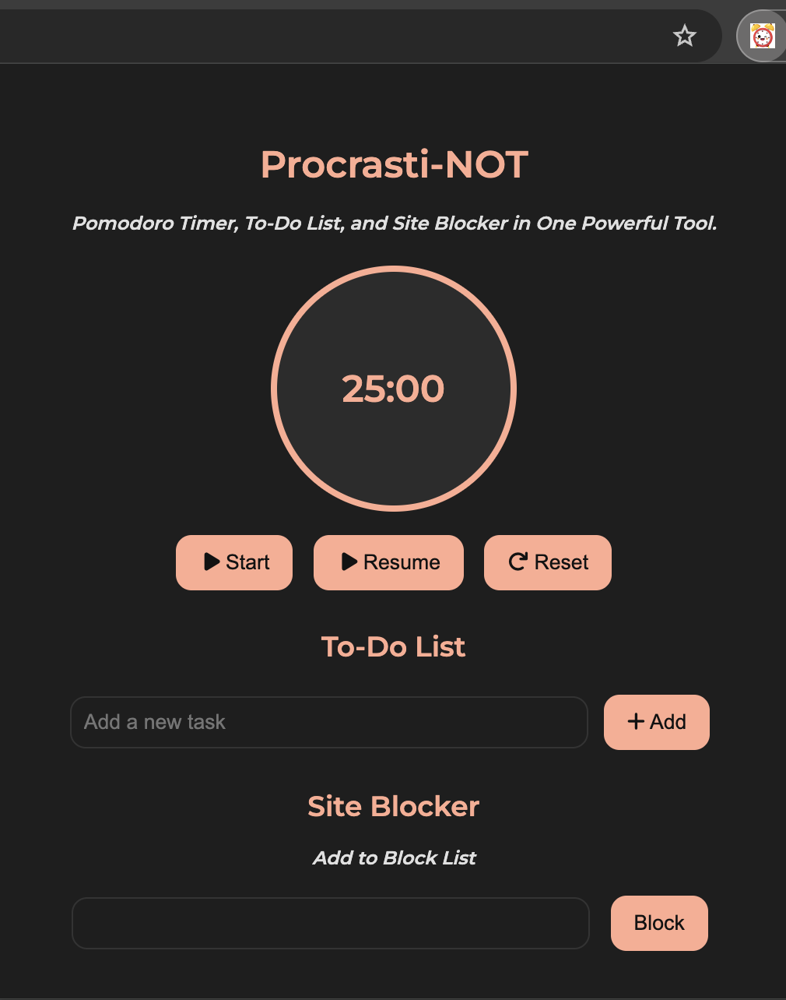
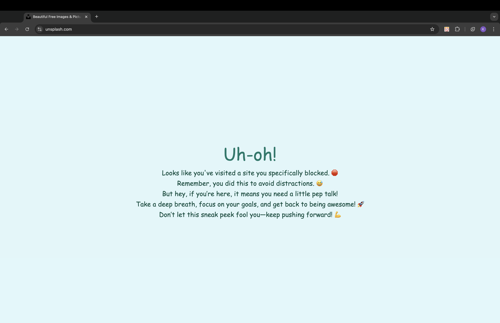

# Procrasti-NOT
 Procrasti-NOT is a versatile Chrome extension designed to enhance productivity by combining three essential tools into one seamless interface: a Pomodoro timer, a to-do list, and a site blocker. This all-in-one tool helps users stay focused, organized, and distraction-free.

 ## Table of Contents
- [How To Add the Extension to the Chrome Browser](#how-to-add)

- [Features](#features)

## How To Add and Use the Extension to the Chrome Browser
- Open the repository on GitHub and click the green 'Code' button dropdown
- In the 'Local' tab, select the option to 'Download ZIP' and download it to a temporary location on your computer
- Unzip the folder
- In Google Chrome, select the 'Extensions' option (puzzle icon beside the URL bar), then click 'Manage Extensions'
- Toggle the 'Developer mode' option (in the upper right corner) to on
- Select 'Load unpacked'
- Find the folder with the unzipped files, select it (note: do not double-click/'Open' it, just select it), and click 'Select Folder'
- Ensure the extension is enabled (the switch is blue)
- Toggle the 'Developer mode' option (in the upper right corner) back to off
- Select the 'Extensions' puzzle icon and click 'Procrasti-NOT'

## Features
- Use the Pomodoro timer to manage your work sessions (25 min)
- Add tasks to the to-do list to keep track of your work. The to-do list is retained until deleted.
- Block distracting websites:
  - Enter the website URL in the 'Add to Block List' input area and click 'Block'
  - To remove a website from your block list, click the trash icon next to the URL
  - Websites should be entered in the format (www.websitename.com) or (websitename.com)
- Timer Badge: A convenient badge displays the current Pomodoro timer right in your Chrome browser. You don’t need to open the extension each time to check the timer status. This badge dynamically updates to show the remaining time on your current Pomodoro session, helping you keep track of your work without interrupting your workflow. 

## Thank you for checking out Procrasti-NOT. Happy focusing!

